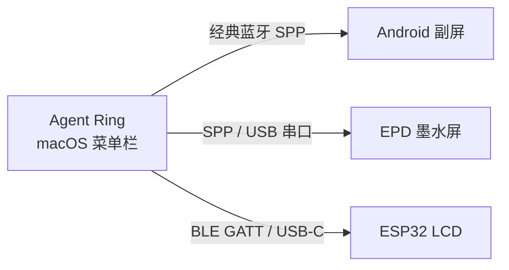

# Agent Ring

[English](README_EN.md) · 简体中文

<p align="center">
  
</p>

<p align="center">
  <strong>macOS 菜单栏上的 AI 用量圆环</strong><br />
  像 Apple Watch 健身圆环那样，一眼看清 Codex、Cursor、GLM、Kimi、Antigravity 还剩多少额度。<br />
  Swift 原生，安装包不到 7 MB。
</p>

<p align="center">
  <a href="https://github.com/haorui-lab/agentRing/releases/latest"></a>
</p>

<p align="center">
  
  
  
  
  
  
</p>

<p align="center">
  
</p>

## 界面预览

| 通用设置 | 账户认证 |
| :---: | :---: |
|  |  |

## 下载

1. 打开 [Latest Release](https://github.com/haorui-lab/agentRing/releases/latest)
2. 下载 `AgentRing-*-macos.dmg`（约 7 MB）
3. 退出旧版，打开 DMG，将 `AgentRing.app` 拖入「应用程序」并选择替换
4. 若系统提示无法验证开发者，在「系统设置 → 隐私与安全性」中选择「仍要打开」

> 发布包使用 ad-hoc 应用签名，未经 Apple 公证。安装含 Sparkle 的版本后，应用内更新会验证 EdDSA 签名并自动安装重启；更早版本需要手动覆盖安装一次。

## 功能

- **AI 编程助手额度聚合**：菜单栏同屏圆环监视，当前支持 Codex、Cursor、GLM Coding Plan、Kimi Coding Plan、Antigravity
- **原生设置质感**：侧边栏 + 分段认证页
- **跟随系统**：深浅色、时间格式；界面语言为简体中文 / English
- **多账户**：登录、切换、别名；GLM / Kimi 粘贴 API Key（支持从 Claude Code 当前配置一键导入），Antigravity 使用本机凭证探测
- **智能刷新**：用量变化时加快，空闲时放慢
- **极简入口**：数据面板 `…` 直接进入设置
- **副屏生态**：同一套圆环可推到 Android 闲置机、EPD 墨水屏、ESP32 LCD，全程本机直连

## 副屏生态

Agent Ring 不只是菜单栏小圆环。Mac 端采集用量后，可以把同一套数据推到工位旁的第二块屏上——经典蓝牙、BLE 或 USB 直连，不经过云端。设置里打开「蓝牙副屏同步」即可，支持 1:N，多块副屏可同时在线。



| 产品 | 适合谁 | 连接方式 | 仓库 |
| :--- | :--- | :--- | :--- |
| **Agent Ring** | macOS 菜单栏主应用 | — | 本仓库 |
| **Android 副屏** | 闲置 Android 手机 / 小平板 | 经典蓝牙 SPP | [davidhoo/agentRing-Android](https://github.com/davidhoo/agentRing-Android) |
| **EPD 墨水屏** | 4.2" 三色电子纸摆件 | 经典蓝牙 SPP / USB 串口 | [davidhoo/agentRing-EPD](https://github.com/davidhoo/agentRing-EPD) |
| **ESP32 LCD** | ESP32-P4 7" IPS 触摸屏 | BLE 5.0 GATT / USB-C | [haorui-lab/agentRing-ESP32-LCD](https://github.com/haorui-lab/agentRing-ESP32-LCD) |

### [agentRing-Android](https://github.com/davidhoo/agentRing-Android)

手头有一台闲置 Android 设备，就可以把它变成桌面监视器。兼容 Android 5.0+，屏幕常亮、沉浸全屏，经经典蓝牙 SPP 实时同步用量、同心圆环与重置倒计时。

### [agentRing-EPD](https://github.com/davidhoo/agentRing-EPD)

给喜欢折腾墨水屏的人准备的桌面摆件。适配 4.2" 黑白红三色电子纸（400×300），数据变化才刷新，经典蓝牙 SPP 与 USB 串口双通道，适合长时间常显、低功耗。

### [agentRing-ESP32-LCD](https://github.com/haorui-lab/agentRing-ESP32-LCD)

给 ESP32 开发板准备的 IPS 副屏固件。面向微雪 ESP32-P4 7" 1024×600 电容触摸屏，LVGL 9 渲染，BLE 5.0 GATT 通电即连，也可走 USB-C 串口，无需在系统设置里手动配对。

想自己做一块屏？JSON 帧格式与连接约定见 [`docs/BLUETOOTH_PROTOCOL.md`](docs/BLUETOOTH_PROTOCOL.md)。欢迎适配更多硬件。

## 从源码构建

**要求**：macOS 13+、Xcode 15+

```bash
git clone https://github.com/haorui-lab/agentRing.git
cd agentRing
open AgentRing.xcodeproj
```

在 Xcode 中选择 scheme **AgentRing**，按 `⌘R` 运行。应用图标将出现在菜单栏。

命令行构建：

```bash
xcodebuild -project AgentRing.xcodeproj -scheme AgentRing \
  -configuration Debug -derivedDataPath ./build-temp build \
  && open ./build-temp/Build/Products/Debug/AgentRing.app
```

## 系统要求

- macOS 13.0+
- Apple Silicon 或 Intel

## 文档

- 蓝牙副屏协议：[`docs/BLUETOOTH_PROTOCOL.md`](docs/BLUETOOTH_PROTOCOL.md)
- 发布流程：[`docs/RELEASING.md`](docs/RELEASING.md)
- 应用内更新：[`docs/auto-update.md`](docs/auto-update.md)

## 参与贡献

欢迎 Issue 和 Pull Request。副屏适配请遵循蓝牙协议规范，并在对应的 Android / EPD / ESP32 仓库提交。

## 开源协议

[MIT License](LICENSE)

基于 [f-is-h/Usage4Claude](https://github.com/f-is-h/Usage4Claude) 分支演进，致谢上游作者。

## 说明

- Bundle ID 为 `app.agentring.AgentRing`；首次升级会从旧 ID `app.agentsring.AgentsRing` 迁移钥匙串与偏好设置。对外显示名为 **Agent Ring**。
