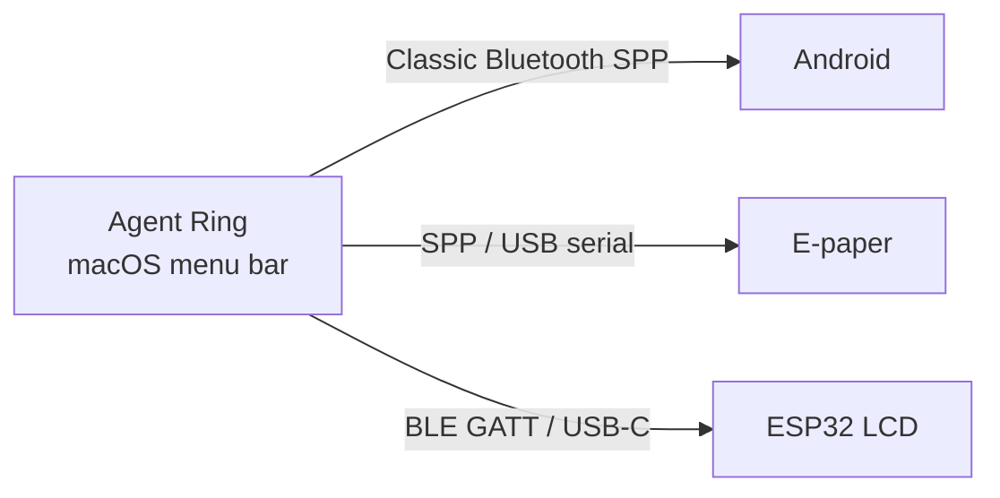

# Agent Ring

[简体中文](README.md) · English

<p align="center">
  
</p>

<p align="center">
  <strong>AI usage rings in your macOS menu bar</strong><br />
  See remaining Codex, Cursor, GLM, Kimi, and Antigravity quota the way Apple Watch shows Activity rings.<br />
  Native Swift. Installer under 7 MB.
</p>

<p align="center">
  <a href="https://github.com/haorui-lab/agentRing/releases/latest"></a>
</p>

<p align="center">
  
  
  
  
  
  
</p>

<p align="center">
  
</p>

## Interface Preview

| General Settings | Account Auth |
| :---: | :---: |
|  |  |

## Download

1. Open [Latest Release](https://github.com/haorui-lab/agentRing/releases/latest)
2. Download `AgentRing-*-macos.dmg` (~7 MB)
3. Quit the old version, open the DMG, and drag `AgentRing.app` into Applications, replacing the old copy
4. If macOS blocks it, use **System Settings → Privacy & Security → Open Anyway**

> Builds are ad-hoc signed and not Apple-notarized. Sparkle verifies in-app updates with EdDSA signatures before installing and restarting. Users of pre-Sparkle versions need one manual replacement installation.

## Features

- **AI usage aggregation**: glanceable menu bar rings; currently supports Codex, Cursor, GLM Coding Plan, Kimi Coding Plan, and Antigravity
- **Native settings feel**: sidebar + segmented auth
- **Follows the system**: appearance and clock; UI languages: Simplified Chinese / English
- **Multi-account**: login, switch, aliases; GLM / Kimi take pasted API keys (one-click import from the current Claude Code config), Antigravity uses local credential discovery
- **Smart refresh**: faster when usage moves, slower when idle
- **Short path**: popover `…` opens Settings directly
- **Companion displays**: the same rings can stream to an idle Android phone, an e-paper panel, or an ESP32 LCD — all on-device, no cloud

## Companion Display Ecosystem

Agent Ring is the data source. After it collects quota on the Mac, it can push the same rings to a second screen on your desk — over classic Bluetooth, BLE, or USB, with no cloud in between. Turn on **Bluetooth companion sync** in Settings. 1:N is supported, so several displays can stay online at once.



| Product | Best for | Transport | Repository |
| :--- | :--- | :--- | :--- |
| **Agent Ring** | macOS menu bar host | — | This repo |
| **Android companion** | Idle Android phone / small tablet | Classic Bluetooth SPP | [davidhoo/agentRing-Android](https://github.com/davidhoo/agentRing-Android) |
| **EPD companion** | 4.2" three-color e-paper desk gadget | Classic Bluetooth SPP / USB serial | [davidhoo/agentRing-EPD](https://github.com/davidhoo/agentRing-EPD) |
| **ESP32 LCD** | ESP32-P4 7" IPS touch panel | BLE 5.0 GATT / USB-C | [haorui-lab/agentRing-ESP32-LCD](https://github.com/haorui-lab/agentRing-ESP32-LCD) |

### [agentRing-Android](https://github.com/davidhoo/agentRing-Android)

Turn an idle Android 5.0+ phone into a desk monitor. Always-on immersive display; live quota, concentric rings, and reset countdowns over classic Bluetooth SPP.

### [agentRing-EPD](https://github.com/davidhoo/agentRing-EPD)

A low-power e-paper desk gadget. Built for a 4.2" black/white/red panel (400×300), refreshes only when quota changes, and accepts both classic Bluetooth SPP and USB serial.

### [agentRing-ESP32-LCD](https://github.com/haorui-lab/agentRing-ESP32-LCD)

Firmware for an ESP32-P4 7" 1024×600 IPS capacitive panel (Waveshare), rendered with LVGL 9. Connects over BLE 5.0 GATT as soon as it powers on, or over USB-C serial — no manual pairing in System Settings.

Building your own display? Frame format and connection rules live in [`docs/BLUETOOTH_PROTOCOL.md`](docs/BLUETOOTH_PROTOCOL.md). Additional hardware ports are welcome.

## Building from Source

**Requires**: macOS 13+, Xcode 15+

```bash
git clone https://github.com/haorui-lab/agentRing.git
cd agentRing
open AgentRing.xcodeproj
```

Select scheme **AgentRing**, press `⌘R`. The app icon appears in the menu bar.

CLI build:

```bash
xcodebuild -project AgentRing.xcodeproj -scheme AgentRing \
  -configuration Debug -derivedDataPath ./build-temp build \
  && open ./build-temp/Build/Products/Debug/AgentRing.app
```

## Requirements

- macOS 13.0+
- Apple Silicon or Intel

## Docs

- Bluetooth companion protocol: [`docs/BLUETOOTH_PROTOCOL.md`](docs/BLUETOOTH_PROTOCOL.md)
- Release process: [`docs/RELEASING.md`](docs/RELEASING.md)
- In-app updates: [`docs/auto-update.md`](docs/auto-update.md)

## Contributing

Issues and pull requests are welcome. Companion-display ports should follow the Bluetooth protocol and land in the matching Android / EPD / ESP32 repository.

## License

[MIT](LICENSE). Forked from [f-is-h/Usage4Claude](https://github.com/f-is-h/Usage4Claude) — thanks to the upstream author.

## Notes

- Bundle ID is `app.agentring.AgentRing`. On first upgrade, credentials and preferences migrate from the legacy ID `app.agentsring.AgentsRing`. Display name is **Agent Ring**.
